# MessageCenter:字节跳动工程训练营客户端方向作业
## 简介
本项目是`字节跳动工程训练营`客户端方向抖音增长部门的结业作业，实现了一个简版的抖音消息中心，包含消息列表展示、本地持久化存储、消息模拟分发、搜索及备注等功能。
项目采用Kotlin语言开发，UI框架完全基于Jetpack Compose，架构模式采用MVVM。
## 产物地址
https://github.com/douhenhuidyf/MessageCenter
## 开发环境
- IDE:AndroidStudioOtter|2025.2.1Patch1
- Language:Kotlin2.2.0
- UIFramework:JetpackCompose(Material3)
- BuildSystem:Gradle(KotlinDSL)
- Andorid SDK:31~36
## 功能介绍
### 基础IM消息通讯
1. 消息列表:
- 展示联系人头像、昵称、置顶状态、最后一条消息预览及时间戳。
- 实时显示未读消息红点，支持下拉刷新。
2. 对话详情:
- 多类型消息渲染:支持文本、图片、运营卡片（文本+按钮）三种消息类型。图片使用图床url加载。
- 消息发送:向联系人发送消息后，模拟用户发送返回文本。
3. 全局搜索:
- 支持对本地历史消息进行关键词检索。
- 搜索结果页对匹配的关键词进行高亮显示。
4. 模拟消息推送和新消息通知:
- 利用WorkManager在后台模拟服务端推送。
- 动态将预置的JSON新消息写入数据库，触发客户端未读提醒，模拟真实的用户唤醒场景。
- 收到新消息后，可在应用内弹出通知弹窗，用户可点击进入相应联系人对话或上滑关闭弹窗。
### 增长策略数据监控
1. 数据看板:
- 提供可视化的数据看板，实时统计关键增长指标。包括未读消息数、消息打开率(CTR)、系统消息召回率（针对官方运营号的点击转化统计）。
2. 运营消息分发:
- 系统账号具备独立标识，用于区分普通用户会话，便于单独统计召回数据。
- 支持模拟下发“新客专享”、“热门推荐”、“在线商城”的官方级运营消息，运营消息支持按钮点击，接入后端即可完全实现营销方案。
### 多语言和颜色模式适配
1. 多语言：支持中文和英文界面切换
2. 颜色模式：支持浅色、神色模式和跟随系统
### 调试功能和异常状态提示
1. 异常状态处理:
- 无网模式:断网环境下的下拉刷新行为，弹出标准化的“无网络”提示对话框。
- 空状态处理:无消息数据时，发出相应提示。
2. 应用调试:
- 清除或写入消息记录
- 接收新开关，用于测试接收新消息。
## 整体架构设计
  本项目采用标准的MVVM(Model-View-ViewModel)分层架构，遵循单一数据源原则。
  MVVM模式由三个关键组件组成：
1. Model（模型）：表示应用程序的数据和业务逻辑，与UI完全无关。模型可以是简单的数据对象，也可以是复杂的业务领域模型。
2. ViewModel（视图模型）：作为View和Model之间的中介，负责处理View的所有显示逻辑和用户交互逻辑。ViewModel暴露Model的数据和命令，使它们易于View进行绑定。
3. View（视图）：定义UI的结构、布局和外观，是用户与应用程序交互的界面。在MVVM中，视图是被动的，它通过数据绑定从ViewModel获取数据并显示。
   MVVM的核心思想是通过数据绑定和命令实现View和ViewModel的松耦合。这种方式降低了直接操作UI元素的需要，使代码更易于维护和测试，其结构图如下所示。
             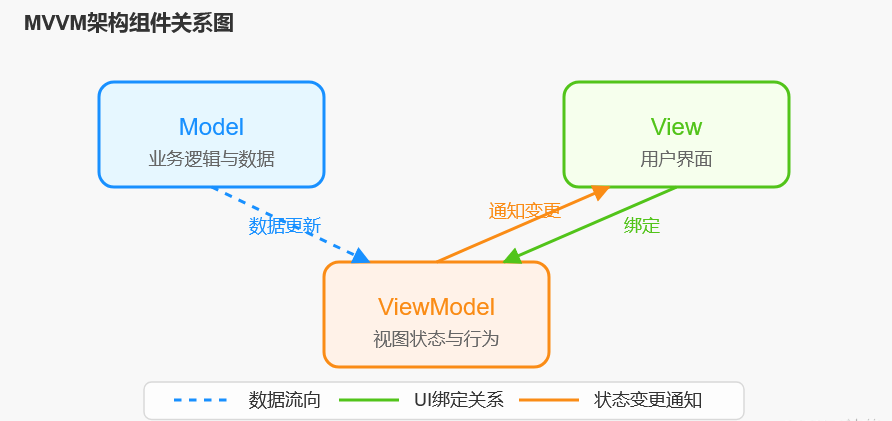
### 模块说明
**1. UILayer(View):**
   这是用户直接看到的UI层级，负责将数据展示给用户并响应用户操作。用户与UI交互时，UI向ViewModel发出用户相关事件，更新相关数据。UI层在本项目中包括：
- Screens:MessageScreen(消息列表)，ConversationScreen(会话页面)，SettingScreen(设置页面)等可使页面。
- Components:包括不同页面内的可复用组件如MessageCell，SearchBar，TextField。
- State:使用StateFlow和ComposeState管理UI状态，使得UI是数据状态的纯函数映射。

**2. ViewModelLayer(ViewModel):**
   ViewModel持有Model，将数据转换为UIState，并处理用户事件。根据不同的用户动作修改数据层的数据。ViewModel层在本项目中包括：
- ContactViewModel:管理联系人列表、未读数统计、增长数据计算。
- ConversationViewModel:管理具体会话的消息流、发送消息逻辑。
- SettingViewModel:管理应用设置相关数据。
- Worker:MessageResponseWorker模拟接收到新消息从并写入数据库。

**3. DataLayer(Model):**
   数据层负责存储应用数据，主要包括SQL数据库和Preferences首选项两种实现方式。数据层在本项目中包括：
- Database:包含ContactEntity和MessageEntity，实现联系人和对话消息数据持久化。
- Repository:ContactRepository和MessageRepository。作为单例的中间媒介实现数据库各项操作。
- SettingPreferences:存储包括颜色模式、调试状态等的应用设置数据。
## 功能点实现方式
**1. 数据存储**
   联系人数据和消息数据使用Room数据库存储，应用设置数据使用Datastore Preferences存储
**2. 数据处理**
- 全应用采用Kotlin Coroutines异步处理耗时操作（IO 读写、数据库查询），避免阻塞主线程。
- 使用StateFlow和SharedFlow在ViewModel和UI之间传递状态，确保遵循单向数据流模式。
**3. 数据展示**
- 联系人列表使用LazyColumn懒加载列表，分页加载联系人数据
- 图片使用Coil库异步加载图片
- 使用Flow数据源，确保数据变换实时反应在UI层。
## 数据库设计与迁移方案
### 数据库模型
  为了支持高效的关联查询和统计，项目将联系人和消息存储在同一个数据库实例的两个不同表中。
  #### 表1:Contacts(联系人表)

  | 字段名           | 类型              | 说明                         |
  |------------------|-------------------|----------------------------|
  | id               | Int (PK)          | 自增主键                       |
  | contactId        | Int (UK)          | 联系人唯一标识                    |
  | contactName      | String            | 联系人名称                      |
  | contactSureName  | String?           | 联系人昵称（可空）                  |
  | contactAvatar    | String            | 头像 URL                     |
  | unReadNum        | Int               | 未读消息数                      |
  | isFromSystem     | Boolean           | 是否为官方/系统账号（用于统计）           |
  | isPinned         | Boolean           | 是否置顶                       |
  | isMute           | Boolean           | 是否静音                       |
  | previewText      | String            | 最新消息预览文本                   |
  | timestamp        | Long              | 最新消息时间戳                    |

 #### 表2:Messages(消息表)
| 字段名         | 类型      | 说明                                   |   
|----------------|-----------|--------------------------------------|
| id             | Int (PK)  | 自增主键                                 |
| conversationId | Int (FK)  | 关联的联系人 ID（Contacts.contactId）        |
| senderId       | Int       | 发送者 ID（0 代表当前用户）                     |
| msgType        | Int       | 消息类型：0 文本，1 图片，2 运营卡片                |
| messageText    | String    | 消息内容                                 |
| extraData      | String?   | 可选额外数据（图片 URL、富文本链接等）                |
| timestamp      | Long      | 时间戳                                  |

### 迁移方案
  使用Room数据库时，迁移数据库十分容易，只需以下步骤：
1. 创建Migration类(例如MIGRATION_1_2)。
2. 在migrate方法中编写SQL语句（如ALTERTABLEADDCOLUMN）。
3. 在Room.databaseBuilder中通过.addMigrations()注册。
   以下代码即可实现Schema升级：为contacts联系人表增加isPinned和isMuted字段。
```kotlin
   @Database(entities = [ContactEntity::class, MessageEntity::class], version = 2, exportSchema = false)
   abstract class AppDatabase : RoomDatabase() {
   abstract fun contactDao(): ContactEntityDao
   abstract fun messageDao(): MessageEntityDao

   companion object {
   @Volatile
   private var Instance: AppDatabase? = null

        val MIGRATION_1_2 = object : Migration(1, 2) {
            override fun migrate(database: SupportSQLiteDatabase) {
                database.execSQL("ALTER TABLE contacts ADD COLUMN isPinned INTEGER NOT NULL DEFAULT 0")
                database.execSQL("ALTER TABLE contacts ADD COLUMN isMuted INTEGER NOT NULL DEFAULT 0")
            }
        }

        fun getDatabase(context: Context): AppDatabase {
            return Instance ?: synchronized(this) {
                Room.databaseBuilder(context, AppDatabase::class.java, "app_database")
                    .addMigrations(MIGRATION_1_2)
                    .build()
                    .also { Instance = it }
            }
        }
   }
 }
```
## 消息中心机制说明
   为了模拟真实的IM环境，项目实现了一套完整的“生成-分发-接收”机制。 
### 数据预制
   预制了数量足够的消息打包进应用，在需要时可以使用。
- generate_conversation.py:生成历史会话记录，模拟不同时间段（包括刚刚、昨天、7天前）的消息。
- generate_income_message.py:生成待接收的“新消息”队列，包含文本、图片及系统运营卡片消息。
### 动态插入
  利用AndroidWorkManager实现后台模拟推送：
1. 触发:开启“接收新消息”选项触发MessageResponseWorker。
2. 读取:Worker从income_messages.json读取预设消息。
3. 写入:使用专用函数将新消息插入messages表，更新contacts表对应联系人的unReadNum和lastMessage预览。未来实现从网络获取消息数据时可直接调用相应函数。
4. 响应:由于使用了Room的Flow，数据库的变更会立即触发ViewModel更新，UI自动刷新并显示未读红点。

## 问题与解决方案
1. 构建消息列表时，上下滑动列表十分卡顿。
   经实验和性能分析，卡顿由使用的compose Image造成，该组件加载大量高分辨率图片时消耗巨大内存性能较差。使用Coil库的AnsycImage组件可解决问题。
2. 调试消息数据库时，删除全部数据后消息列表依然有消息展示。
   分析获取列表数据的流程，发现是因为设置了消息列表为空时返回error状态，不会导致列表更新，修改代码逻辑即可解决。
3. 对话页面打开键盘后，上方TopBar会被顶出页面
   在 Activity 里设置ADJUST_NOTHING，不让系统平移窗口；在 UI层通过imePadding手动避让键盘，让TopBar 不被顶走。
## 功能演示
| 功能模块     | 浅色模式                                                           | 深色模式                                                          |
|--------------|----------------------------------------------------------------|---------------------------------------------------------------|
| 消息列表     | 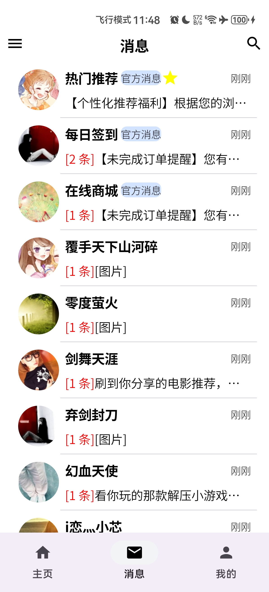 | 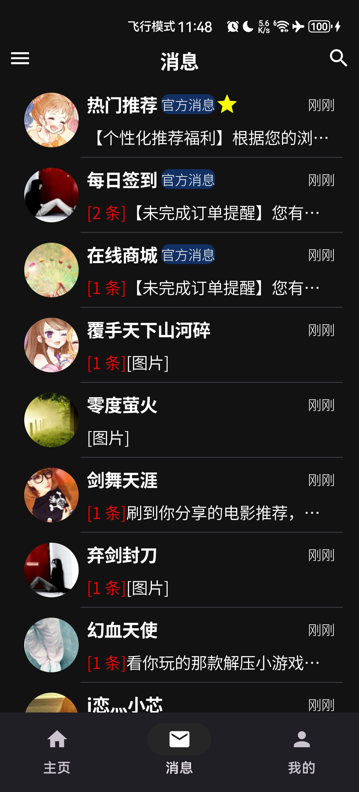 |
| 新消息通知   | 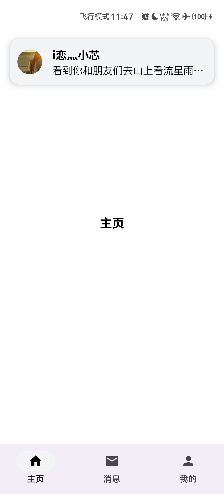    | 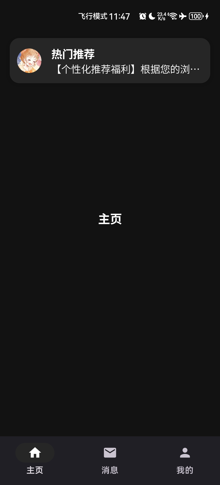    |
| 多类型消息   | 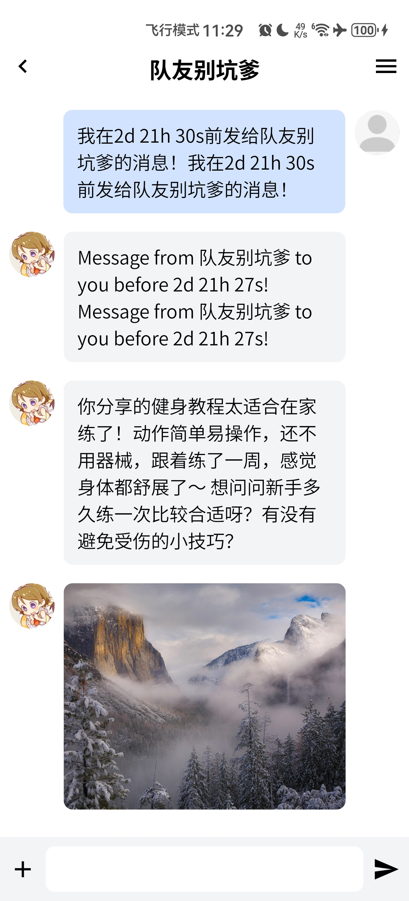 | 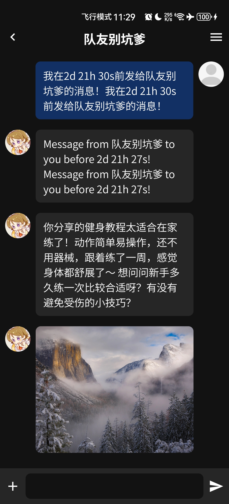 |
| 搜索        |        | 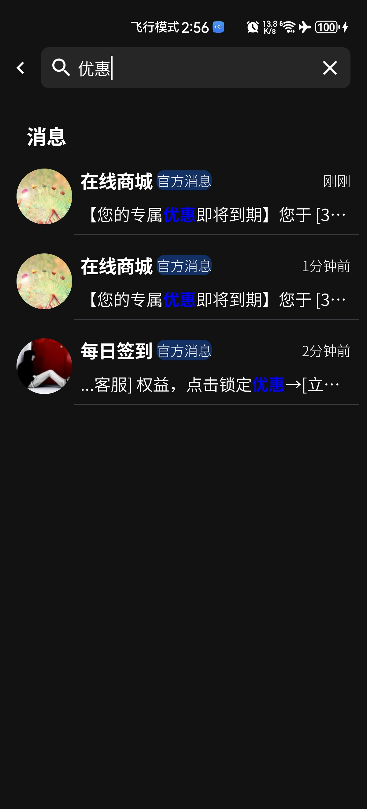       |
| 备注修改    | 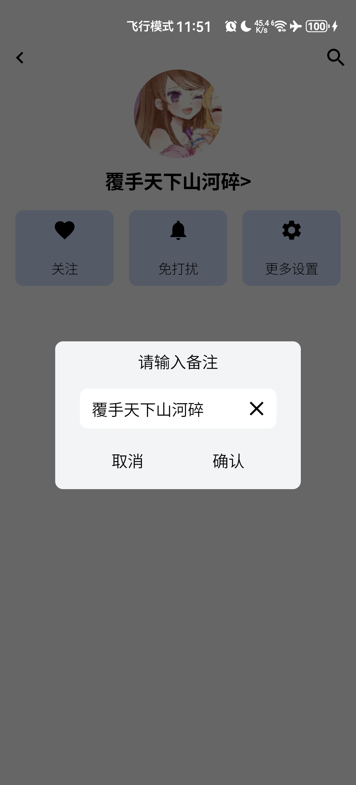     | 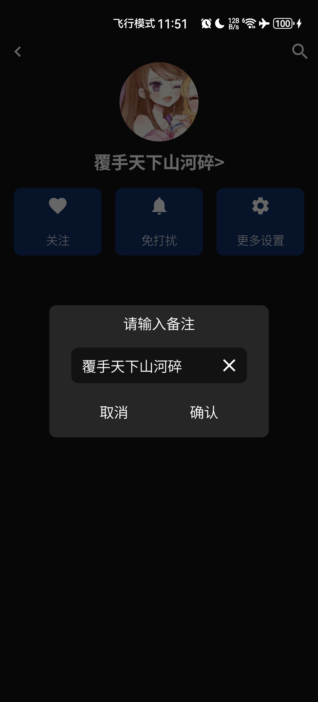     |
| 数据看板    | 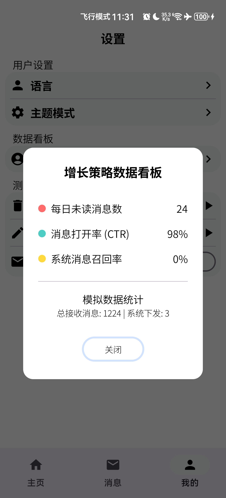     | 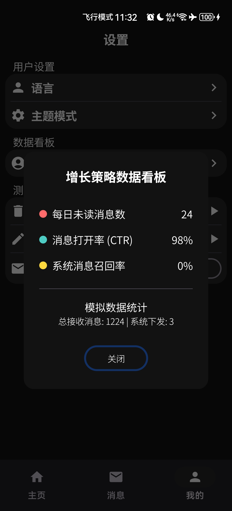     |
| 无网提示    | 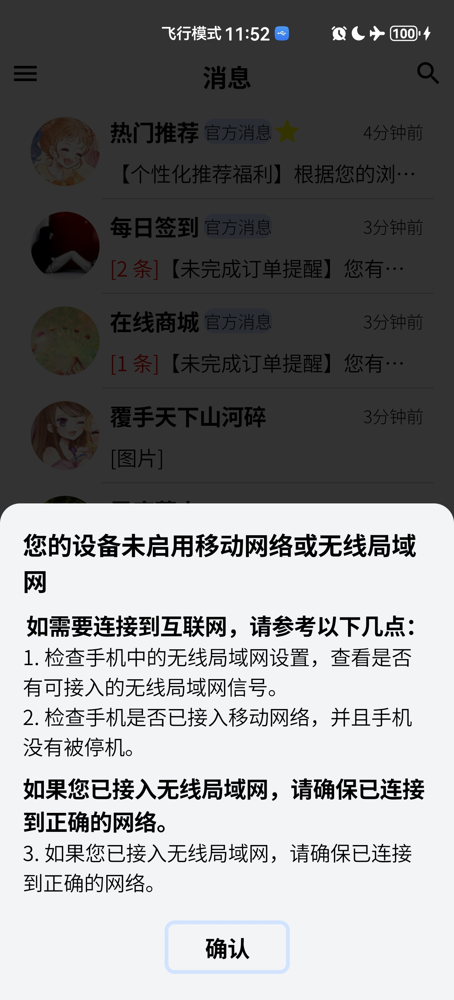       | 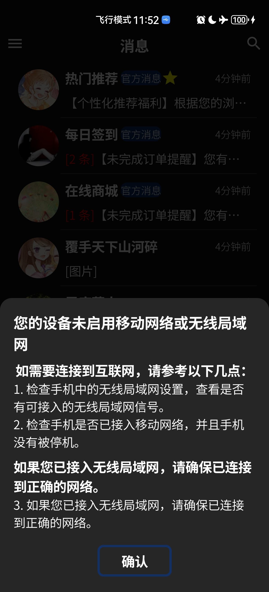       |
